# Configurando um ataque phishing no Kali Linux para captura de senhas do Facebook

## Aviso Importante
Esse guia é só para aprendizado ou testes autorizados. Fazer isso sem permissão é errado e pode trazer problemas sérios, como processos judiciais.

### Ferramentas necessárias

Para esta simulação, você precisará do sistema operacional abaixo instalado e configurado em um ambiente de teste virtual:

- *Kali Linux*: Sistema operacional especializado em testes de segurança e penetração.
- *SET Toolkit* (Social-Engineer Toolkit): ferramenta pré-instalada no Kali Linux para engenharia social.

### Passo a Passo

**1. Ativando o modo administrador (root)**  
Para realizar o teste, você precisará de acesso de administrador (root) do Kali Linux. Dessa forma, terá as permissões necessárias para executar os comandos:
- Abra o terminal;
- Digite: **sudo su** pressione a tecla ENTER e informe a senha (caso seja solicitado).

  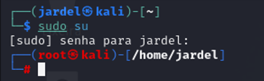

  

**2. Executando a ferramenta SET Toolkit**  
Essa ferramenta open source serve para auxiliar os profissionais de segurança a realizar testes de engenharia social:  
- No terminal, digite: **setoolkit** e pressione a tecla ENTER;

  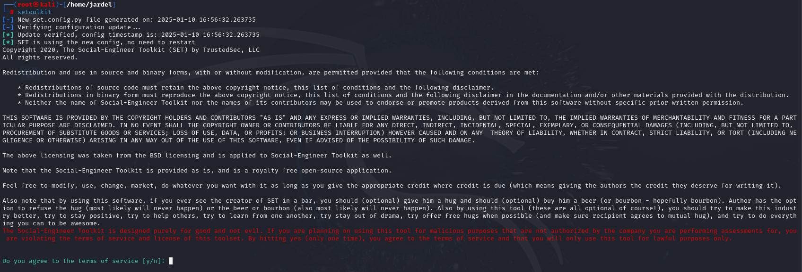

  

- *__Nota:__* se aparecer uma mensagem pedindo confirmação, **digite Y** e pressione a tecla ENTER;
- No menu que será exibido, digite **1** e pressione a tecla ENTER. Essa opção seleciona o **Social Engineering Attacks** (ataques de engenharia social);  

  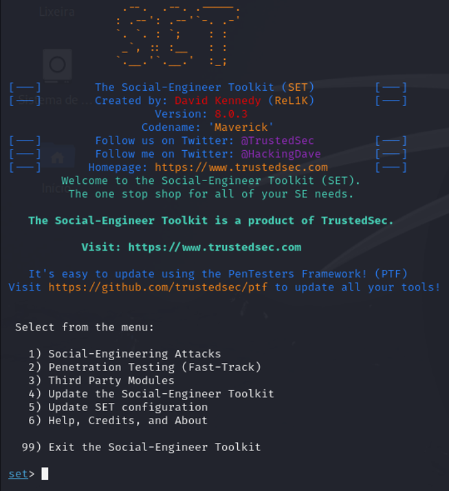

 

- No próximo menu, selecione o vetor de ataque que refere-se a como o phishing irá funcionar. Para este teste, digite **2** (Web Site Attack Vectors) e pressione a tecla ENTER;

  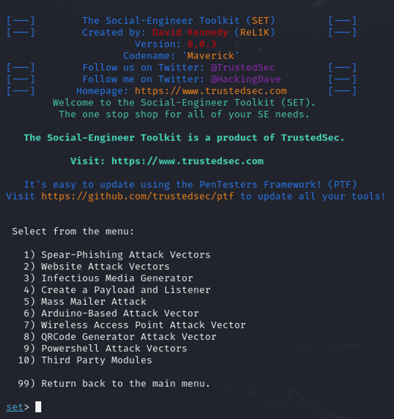

 

- No próximo menu, selecione o método de captura que será como o phishing pegará as informações da vítica. Para este teste, digite **3** (Credential Harvester Attack Method) e pressione a tecla ENTER;

  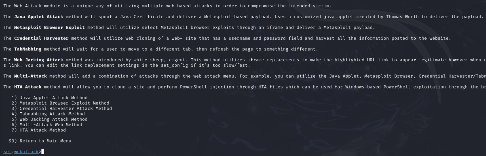

 

- No próximo menu, digite **2** (Site Cloner) e pressione a tecla ENTER;

  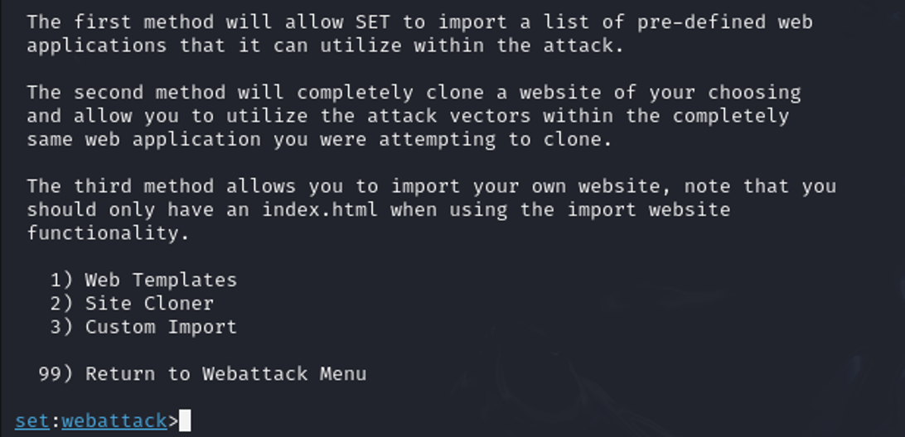

 

- Será necessário informar o endereço IP da máquina que está executando o Kali Linux. Note que, o endereço IP da máquina já será informado no prompt (**para descobrir o endereço IP no Kali Linux vide o passo 3**). Para confirmar o endereço IP exibido, pressione a tecla ENTER;

  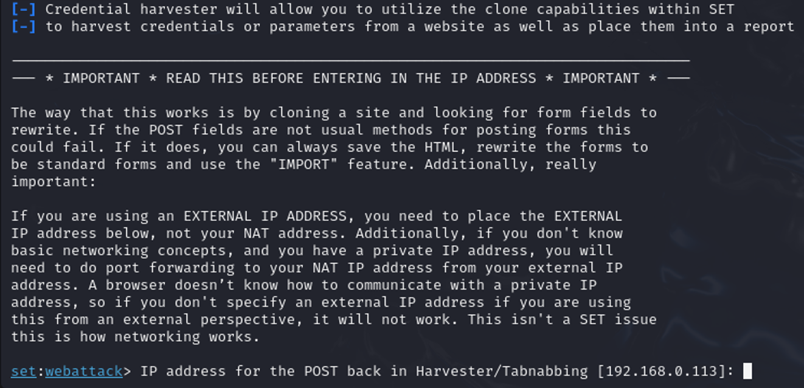

 

- No prompt exibido, digite o site a ser clonado, nesse caso: **http://www.facebook.com** pressione a tecla ENTER. A ferramenta SET Toolkit criará uma cópia do site e começará a capturar as informações das conexões recebidas para este site clonado assim como, os dados de login e senha das pessoas que digitarem na tela de login.

  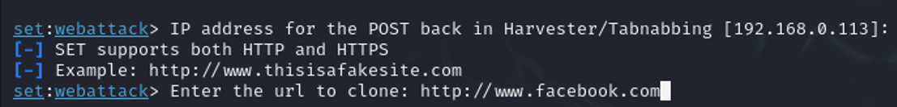

 

  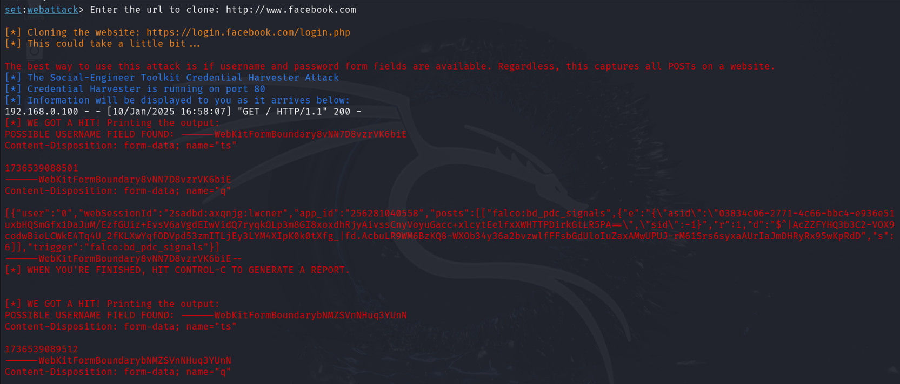

 

**3. Descobrindo o endereço IP da sua máquina Kali Linux**  
- Abra um novo terminal;
- Na tela exibida, digite **ifconfig** e pressione a tecla ENTER;
- Anote o número que será exibido ao lado de *INET*.

  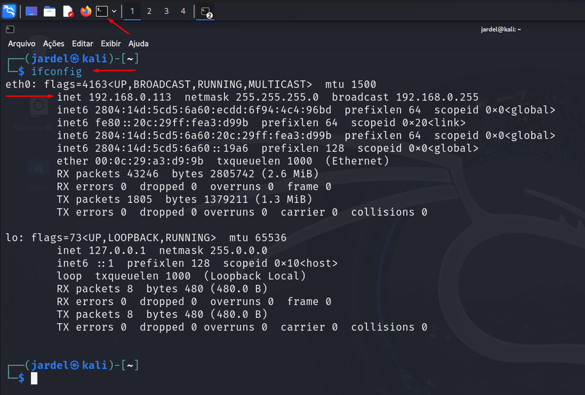

 

**4. Realizando um teste**  
- Utilizando outra máquina, abra qualquer navegador (de preferência utilize uma guia anônima) e na barra de endereços digite o endereço IP da sua máquina Kali Linux;
- Será exibida a "tela de login" do site clonado;

  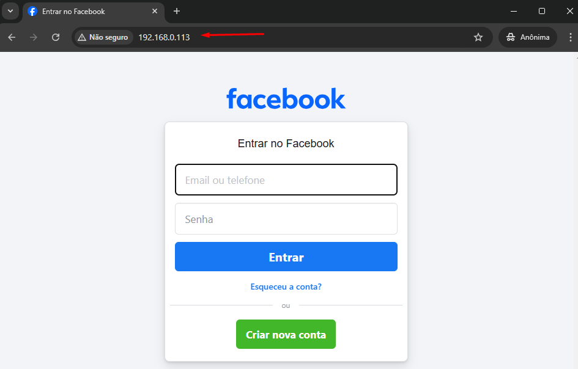

 

- Neste momento, se consultar o terminal no Kali Linux perceberá que o endereço IP do equipamento que acessou o site clonado será apresentado e as demais informações como login e senha serão capturadas assim que o usuário realizar a tentativa de login no site.

  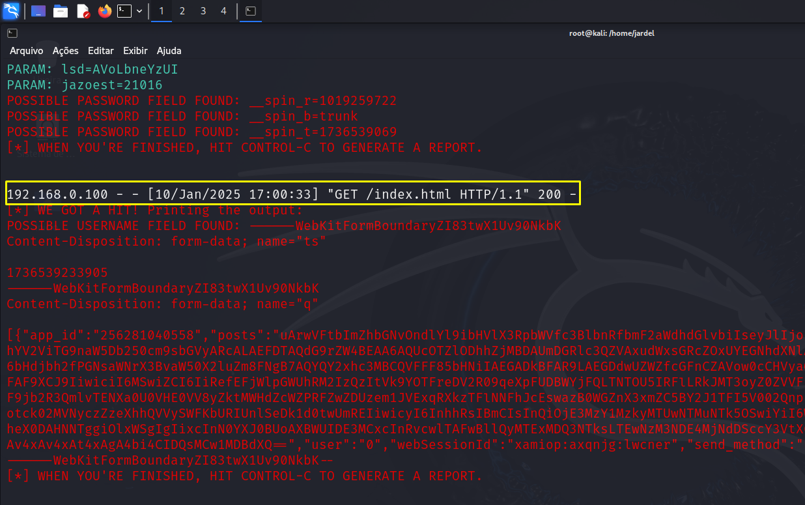

 

### Outras informações
- Para concluir o processo de captura da ferramenta SET Toolkit, **pressione as teclas CTRL + C e em seguida, pressione a tecla ENTER. Um arquivo XML será gerado para análise posterior**;

  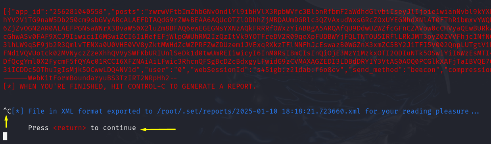

 

- Para fechar a ferramenta SET Toolkit, **digite 99 e pressione a tecla ENTER até retornar ao terminal**.

  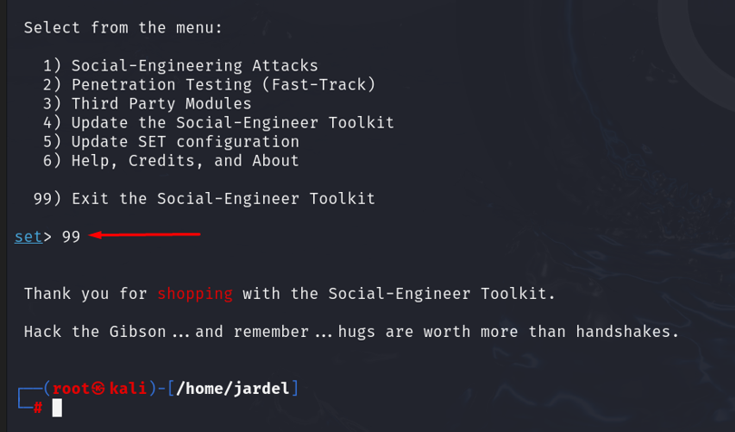

 
